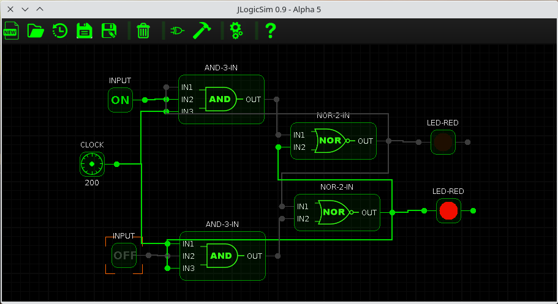
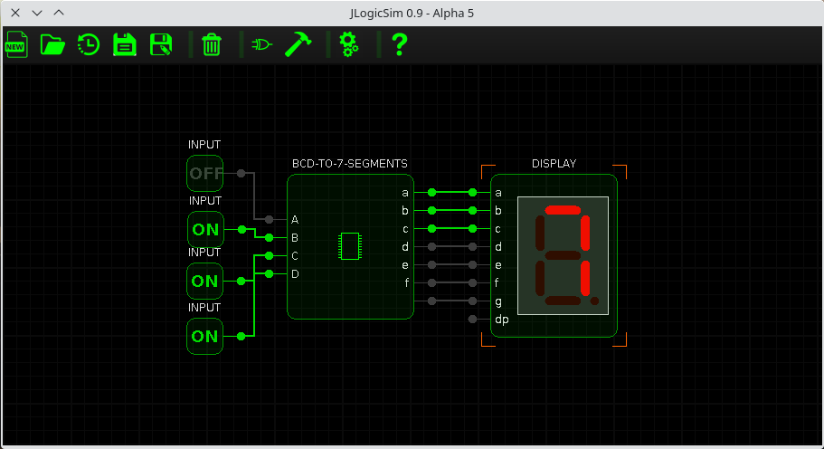
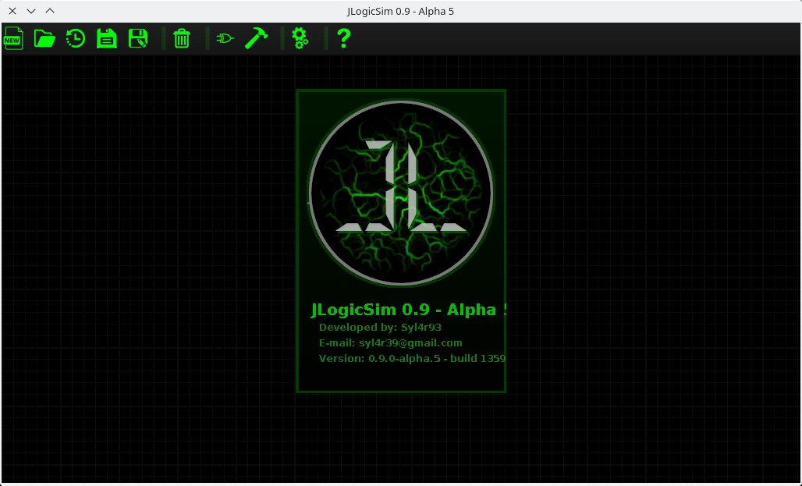

 ## JLogicSim - Java Logic Simulator
 
 A Logic circuit simulator written in Java.
 It is a very old project, and it is being rewritten in C++ here https://github.com/Sylar39/LSPP. 
 Despite it's slowness and messy source code, it is still a good didactical project, that I wrote around 12 years ago.
 
 It's functionality includes:
 * Create custom components by specifying the number of inputs/outputs, and a truth table to set the behavior of the component.
 * Store and Load circuits.
 * Automatic save of the current session on close.
 
 
 
 
